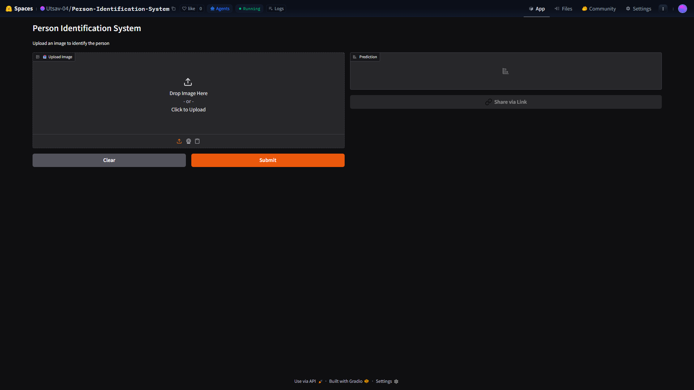
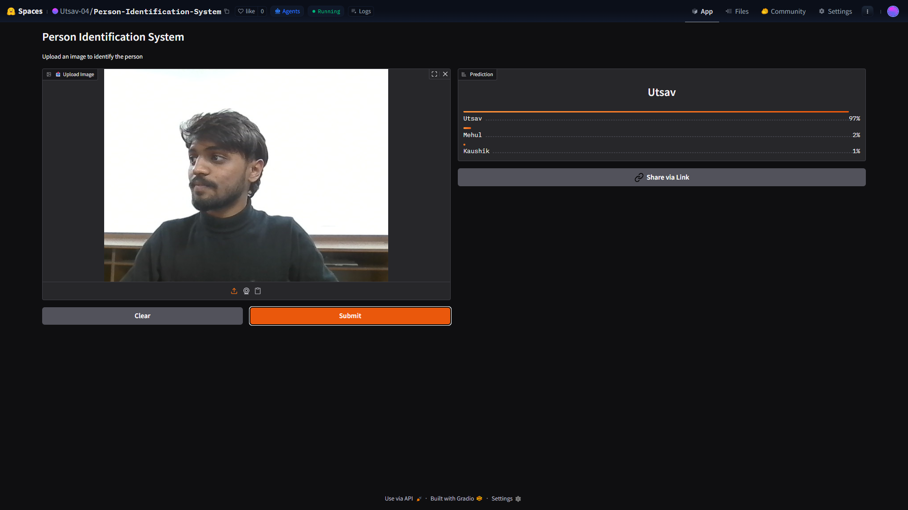
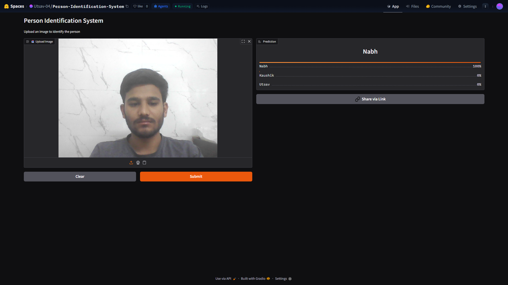
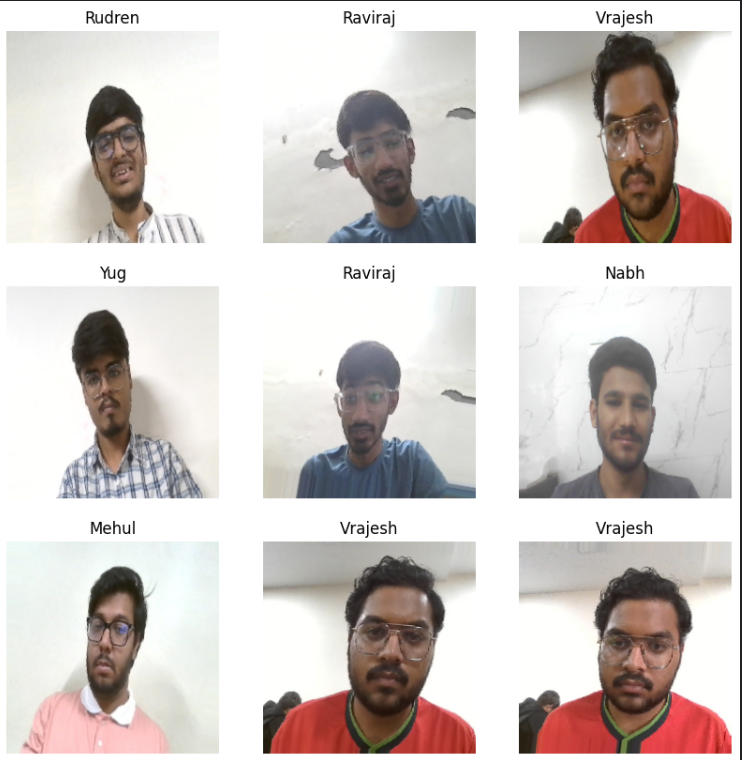
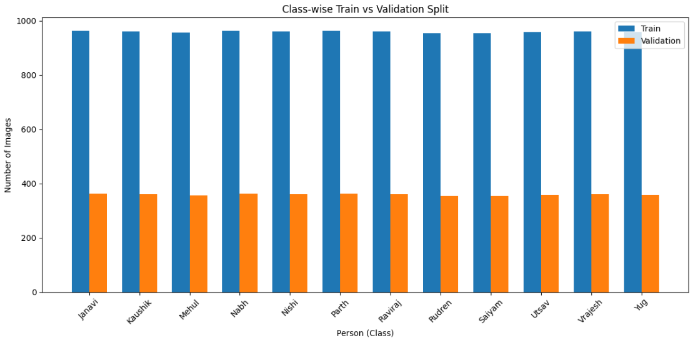
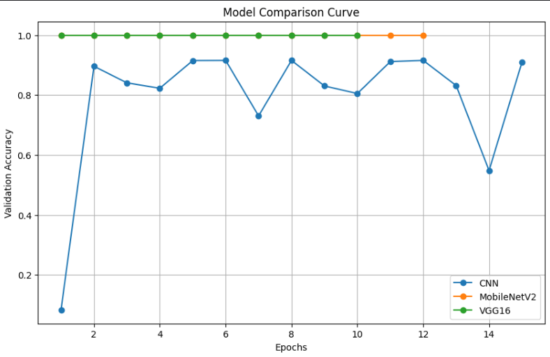
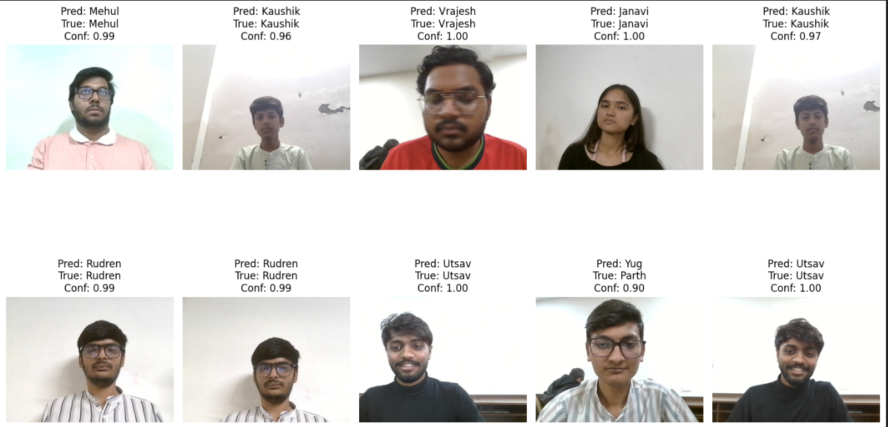

<div align="center">

# 🧠 Person Identification System using CNN

### 🚀 AI-Powered Person Recognition using Deep Learning, Computer Vision & Transfer Learning



<br>


<br>

🔍 Intelligent multi-class person identification system built using Convolutional Neural Networks (CNN), MobileNet Transfer Learning, TensorFlow/Keras, and deployed on Hugging Face Spaces.

</div>


## 🌟 Project Vision

In the modern world of Artificial Intelligence and Computer Vision, image understanding systems are becoming increasingly powerful. From surveillance systems to smart security solutions, AI-driven recognition technologies are transforming the way machines interpret visual information.

This project was developed to explore the real-world capabilities of Deep Learning in identifying individuals from image data using CNN-based architectures.

Rather than creating only a simple image classifier, the objective was to build a complete end-to-end AI pipeline involving:

✨ Dataset Engineering   
✨ Deep Learning Model Training   
✨ Transfer Learning Optimization   
✨ Performance Evaluation   
✨ Interactive Prediction System   
✨ Cloud Deployment   

The final result is an AI-powered person identification system capable of recognizing multiple individuals from uploaded images through an interactive web interface.


## 🎯 Project Highlights

- Deep Learning based Person Identification
- CNN-powered Image Classification
- MobileNet Transfer Learning Architecture
- Multi-Class Recognition System
- Intelligent Confidence Threshold Filtering
- Real-Time Prediction Pipeline
- Interactive Gradio Web Application
- Hugging Face Deployment
- Dataset Visualization & Analysis
- Accuracy Comparison Between Models
- Complete Research Documentation Included


## 🌐 Live AI Demo

## 🤗 Hugging Face Deployment

🔗 https://huggingface.co/spaces/Utsav-04/Person-Identification-System

> ⚠️ Note: Free-tier Hugging Face deployments may take a few seconds to wake up after inactivity.


## 🧠 Deep Learning Pipeline

```bash
Raw Dataset
     ↓
Data Preprocessing
     ↓
Image Normalization
     ↓
Train-Test Split
     ↓
CNN + MobileNet Training
     ↓
Performance Evaluation
     ↓
Prediction Pipeline
     ↓
Gradio Interface
     ↓
Hugging Face Deployment
```


## ⚡ Core Features

| Feature                       | Description                            |
| ----------------------------- | -------------------------------------- |
| 🧠 CNN Classification         | Learns visual patterns from image data |
| ⚡ MobileNet Transfer Learning | Efficient feature extraction backbone  |
| 👁️ Computer Vision Pipeline  | Image preprocessing & recognition      |
| 📊 Model Evaluation           | Accuracy & performance comparison      |
| 🎛️ Interactive UI            | User-friendly Gradio interface         |
| 🔒 Confidence Filtering       | Reduces incorrect predictions          |
| ☁️ Cloud Deployment           | Hosted on Hugging Face Spaces          |
| 📂 Research Workflow          | Includes documentation & report        |


## 🛠️ Tech Stack

| Technology            | Usage                             |
| --------------------- | --------------------------------- |
| 🐍 Python             | Core programming language         |
| 🧠 TensorFlow / Keras | Deep Learning framework           |
| 🔍 CNN                | Feature learning & classification |
| ⚡ MobileNet           | Transfer Learning backbone        |
| 📊 NumPy              | Numerical computation             |
| 🖼️ Pillow            | Image preprocessing               |
| 📈 Matplotlib         | Data visualization                |
| 🎛️ Gradio            | Web application interface         |
| ☁️ Hugging Face       | Cloud deployment                  |


## 📂 Dataset Engineering

The dataset used in this project was synthetically captured and organized into multiple person classes (12 classes) for learning.

### ⚙️ Data Preprocessing Included

* 📷 Raw image collection
* 🔄 Image resizing
* 🧹 Data cleaning
* 📊 Normalization
* ✂️ Train-test splitting
* 🏷️ Multi-class labeling
* 📈 Data visualization

Dataset details are available in:

```bash
DATASET_LINK.md
```

---

## 🏗️ Model Architecture

This project combines Transfer Learning with CNN classification layers to improve image understanding performance.

#### ⚡ MobileNet Backbone

Used for efficient feature extraction from image inputs.

#### 🔍 CNN Classification Layers

Custom dense layers added for multi-class person identification.


## 🧬 Architecture Flow

```bash
Input Image
      ↓
Image Preprocessing
      ↓
MobileNet Feature Extraction
      ↓
CNN Dense Layers
      ↓
Softmax Classification
      ↓
Person Prediction
```


## 📐 Model Specifications

| Parameter              | Value            |
| ---------------------- | ---------------- |
| 📏 Input Size          | 160 × 160        |
| 🧠 Framework           | TensorFlow/Keras |
| 🎯 Classification Type | Multi-Class      |
| ⚡ Architecture         | CNN + MobileNet  |
| ☁️ Deployment          | Hugging Face     |


## 📁 Project Structure

```bash
Person-Identification-System/
│
├── documentation/
│   ├── Person-Identification-System-Report.pdf
│   └── Poster.pdf
│
├── images/
│   ├── comparision.png
│   ├── data-split.png
│   ├── model-acc-compare.png
│   ├── output.png
│   ├── raw-data.png
│   ├── test-1.png
│   ├── test-2.png
│   └── ui.png
│
├── app.py
├── best_model.keras
├── DATASET_LINK.md
├── requirements.txt
├── person-identification-system-finaldraft.ipynb
└── LICENSE
```


## 📊 Model Evaluation & Results

The model was trained and evaluated on multiple person classes using CNN and Transfer Learning techniques.

## 🚀 Key Achievements

- High-performance image classification
- Multi-class recognition capability
- Confidence threshold prediction handling
- Real-time prediction support
- Accuracy comparison visualization
- Efficient deployment-ready pipeline


## 🖼️ Visual Demonstration

## 🎛️ Application Test


---


## 📂 Raw Dataset Visualization




## ✂️ Dataset Split Analysis




## 📈 Model Accuracy Comparison




## 🎯 Output




## ⚙️ Installation & Setup

### Clone Repository

```bash
git clone https://github.com/Utsav-Ratpiya/person-identification-cnn.git
```


### Install Dependencies

```bash
pip install -r requirements.txt
```


### Run Application

```bash
python app.py
```


## 🚀 Future Improvements

This project can be extended into a more advanced AI recognition system with:

✨ Real-Time Webcam Identification   
✨ Face Detection Integration   
✨ Larger & Diverse Dataset Training   
✨ Advanced Transfer Learning Architectures   
✨ Edge AI Optimization   
✨ Smart Surveillance Integration   
✨ Security & Authentication Systems   
✨ Production-Level Deployment   


## 📚 Documentation & Research

The repository also includes complete project documentation inside the `documentation/` folder.

### Included:

- 📄 Detailed Project Report
- 📊 Dataset Workflow
- 🏗️ Architecture Explanation
- 📈 Performance Analysis
- 🎨 Research Poster
- ⚙️ Methodology & Results


## 💡 Learning Outcomes

Through this project, key concepts explored include:

* 🧠 Deep Learning
* 👁️ Computer Vision
* ⚡ Transfer Learning
* 📊 Data Engineering
* 🤖 AI Deployment
* ☁️ Cloud Hosting
* 🎛️ Interactive AI Applications        

This project represents a complete AI development workflow — from dataset engineering to cloud deployment.


## 👨‍💻 Author

### Utsav Ratpiya

🚀 AI / ML / Deep Learning Enthusiast       
📊 Passionate about Artificial Intelligence, Computer Vision, Data Science, and AI-powered systems.
     
🔗 GitHub:
https://github.com/Utsav-Ratpiya        
🔗 Linkedin:
https://www.linkedin.com/in/utsav-ratpiya-2b9470284/         
🔗 Kaggle:
https://www.kaggle.com/utsavratapiya

---

<div align="center">

⭐ If you found this project interesting, consider giving it a star!

</div>
